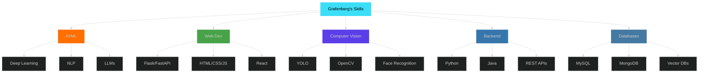

<div align="center">

<!-- Profile Views Counter -->


<!-- Animated Header -->


### 🚀 Full Stack Developer | AI/ML Enthusiast | Open Source Contributor

<!-- Animated Typing Effect -->


<!-- Animated Wave GIF -->


<!-- Social Badges with Hover Effects -->
<p>
  <a href="https://www.linkedin.com/in/grafenberg-langpenn-20191a1a5/">
    
  </a>
  <a href="mailto:grafenaveiro@gmail.com">
    
  </a>
  <a href="https://github.com/grafenx07">
    
  </a>
  <a href="https://twitter.com/grafenx07">
    
  </a>
</p>

<!-- GitHub 3D Contribution Snake -->
<picture>
  <source media="(prefers-color-scheme: dark)" srcset="https://raw.githubusercontent.com/grafenx07/grafenx07/output/github-contribution-grid-snake-dark.svg">
  <source media="(prefers-color-scheme: light)" srcset="https://raw.githubusercontent.com/grafenx07/grafenx07/output/github-contribution-grid-snake.svg">
  
</picture>

<!-- 3D Spaceship Animation -->


</div>


## 🎯 Introduction

<div align="center">

```python
#!/usr/bin/env python3
# -*- coding: utf-8 -*-

class Grafenberg:
    """
    🚀 Welcome to my GitHub Profile!
    Full Stack Developer passionate about AI/ML and Computer Vision
    """

    def __init__(self):
        self.name = "Grafenberg Langpen"
        self.role = "Full Stack Developer & AI/ML Enthusiast"
        self.location = "🇮🇳 India"
        self.languages = ["Python", "Java", "JavaScript", "C", "SQL"]
        self.interests = [
            "🤖 Artificial Intelligence",
            "👁️ Computer Vision",
            "🧠 Deep Learning",
            "🌐 Web Development",
            "🔧 Automation"
        ]
        self.current_focus = "Building intelligent systems with AI"
        self.open_for = ["Collaboration", "Freelance Projects", "Job Opportunities"]
        self.coffee_consumed = "∞"
        self.code_lines_written = "100K+"

    def say_hi(self):
        """Display welcome message"""
        print("👋 Thanks for visiting my profile!")
        print("🌟 Let's build something amazing together!")
        print("💡 Always open to innovative ideas and collaborations!")
        print("🚀 Passionate about creating AI-powered solutions!")

    def get_current_work(self):
        """What I'm currently working on"""
        return {
            "🔭 projects": "AI-powered intelligent applications",
            "🌱 learning": "Advanced deep learning & LLM techniques",
            "👯 looking_for": "Open-source AI/ML collaboration",
            "💬 ask_me_about": "Python, Computer Vision, Flask, AI/ML",
            "⚡ fun_fact": "I automate everything I can!",
            "🎯 goal_2026": "Contribute to major open-source AI projects"
        }

    def contact_me(self):
        """How to reach me"""
        return {
            "email": "grafenaveiro@gmail.com",
            "linkedin": "grafenberg-langpenn",
            "github": "@grafenx07",
            "availability": "Open for opportunities!"
        }

# Initialize and greet
developer = Grafenberg()
developer.say_hi()

# Output:
# 👋 Thanks for visiting my profile!
# 🌟 Let's build something amazing together!
# 💡 Always open to innovative ideas and collaborations!
# 🚀 Passionate about creating AI-powered solutions!
```

</div>

<div align="center">
  
</div>

---

## 🛠️ Tech Stack & Skills

<div align="center">

### 💻 Programming Languages


### 🌐 Web Technologies


### 🤖 AI/ML & Computer Vision


### 🗄️ Databases & Cloud


### 🔧 Developer Tools & Platforms


</div>

---

## 🚀 Featured Projects

<div align="center">

### 💼 My Portfolio of Work


</div>

<table>
<tr>
<td width="50%" valign="top">

<div align="center">

### 🎭 Face Attendance Recognition System


[](https://github.com/grafenx07/Face-Attendance-Recognition)
[](#)


</div>

**🛠️ Tech Stack:**
```
Python • Flask • FaceNet • OpenCV
MySQL • HTML/CSS • JavaScript
```

**✨ Key Features:**
- 👤 Real-time face detection & recognition
- 📊 Automated attendance management
- 🔐 Secure facial embedding storage
- 🖥️ Interactive responsive web UI
- 📈 Analytics & reporting dashboard
- 🔄 Multi-user support
- 📱 Mobile-responsive design
- 📧 Email notifications

**🎯 Use Cases:** Educational institutions, corporate offices, event management

---

</td>
<td width="50%" valign="top">

<div align="center">

### 🚨 Accident Detection System


[](https://github.com/grafenx07/Accident-Detection)
[](#)


</div>

**🛠️ Tech Stack:**
```
Python • YOLOv8 • OpenCV • Twilio
LabelImg • Tkinter • Custom Dataset
```

**✨ Key Features:**
- 🎥 Real-time CCTV footage analysis
- 🚑 Instant SMS alerts via Twilio API
- 🎯 Custom trained YOLO v8 model
- 📍 GPS location integration
- 💻 Intuitive GUI interface
- 📊 Incident logging & statistics
- 🔔 Multi-channel notifications
- 📹 Video recording on detection

**🎯 Use Cases:** Traffic monitoring, highway safety, smart city solutions

---

</td>
</tr>

<tr>
<td width="50%" valign="top">

<div align="center">

### 🤖 Multifunctional Virtual Assistant


[](https://github.com/grafenx07/Virtual-Assistant)
[](#)


</div>

**🛠️ Tech Stack:**
```
Python • CustomTkinter • SpeechRecognition
pyttsx3 • OpenWeatherMap API • Wikipedia API
```

**✨ Key Features:**
- 🎤 Voice-activated command system
- 🌐 Web search & Wikipedia integration
- 🎵 Music player with playlist support
- 🌦️ Real-time weather forecasts
- 💬 Natural language conversation
- 🌍 Multi-language translation
- 📧 Email automation
- ⏰ Reminders & alarms
- 🗣️ Text-to-speech responses
- 🎨 Modern GUI interface

**🎯 Use Cases:** Personal productivity, hands-free computing, accessibility

---

</td>
<td width="50%" valign="top">

<div align="center">

### 🎓 Study Jarvis - AI Study Assistant


[](https://github.com/grafenx07/study-jarvis)
[](https://github.com/grafenx07/study-jarvis/stargazers)


</div>

**🛠️ Tech Stack:**
```
Python • FastAPI • Ollama (LLaMA 3)
Pinecone • RAG • SentenceTransformers
HTML/CSS/JS • Vector Embeddings
```

**✨ Key Features:**
- 📚 Upload & manage study notes (PDF/DOCX/TXT)
- 💬 Intelligent Q&A using RAG architecture
- 📝 Auto-generate summaries from notes
- 📋 Create practice quizzes automatically
- 🎴 Generate flashcards for study
- 🔍 Semantic search with vector embeddings
- 🏠 Self-hosted with local LLM
- 💾 Chat history & conversation management
- 🎯 Context-aware responses
- 🔐 Privacy-first architecture

**🎯 Use Cases:** Exam preparation, research notes, learning assistance

---

</td>
</tr>
</table>

<div align="center">


</div>

---

## 📊 GitHub Statistics

<div align="center">


</div>

<div align="center">

[](https://git.io/streak-stats)

</div>

<div align="center">

### 📈 Contribution Activity

[](https://github.com/ashutosh00710/github-readme-activity-graph)

</div>

---

## 🏆 GitHub Achievements

<div align="center">

[](https://github.com/ryo-ma/github-profile-trophy)

</div>

---

## 📊 Coding Activity & Stats

<div align="center">

### 💻 Weekly Development Breakdown

<!--START_SECTION:waka-->
<!--END_SECTION:waka-->

### 📈 Profile Summary


</div>

---

## 🎯 Skills Radar

<div align="center">



</div>

---

## 🌟 Recent Activity

<!--START_SECTION:activity-->
<!--END_SECTION:activity-->

---

## 📫 Connect With Me

<div align="center">

### 💬 Let's Build Something Amazing Together!

I'm always interested in collaborating on innovative projects or discussing new technologies!

<br>

[](https://www.linkedin.com/in/grafenberg-langpenn-20191a1a5/)
[](mailto:grafenaveiro@gmail.com)
[](https://twitter.com/grafenx07)
[](#)

<br>

### 📧 Contact Information

```yaml
email: grafenaveiro@gmail.com
linkedin: grafenberg-langpenn-20191a1a5
github: grafenx07
location: India 🇮🇳
timezone: IST (UTC+5:30)
availability: Open for opportunities
response_time: Within 24 hours
```

</div>

---

<div align="center">

### 💭 Daily Developer Quote


### 🎮 When I'm Not Coding...

```javascript
const grafenberg = {
    hobbies: ["🎵 Music", "📚 Reading", "🎮 Gaming", "✈️ Traveling"],
    currentlyReading: "Clean Code by Robert C. Martin",
    favoriteQuote: "Code is like humor. When you have to explain it, it's bad.",
    funFact: "I debug with console.log() more than I'd like to admit 😅"
};
```

### 📊 Profile Visitors


### 🌟 Support My Work

If you find my projects helpful, consider buying me a coffee! ☕

[](https://buymeacoffee.com/grafenx07)
[](https://paypal.me/grafenx07)


### 🚀 Thank You for Visiting!


**Made with ❤️ and ☕ by Grafenberg Langpen**

⭐ **If you like my work, consider giving some repositories a star!** ⭐


</div>
